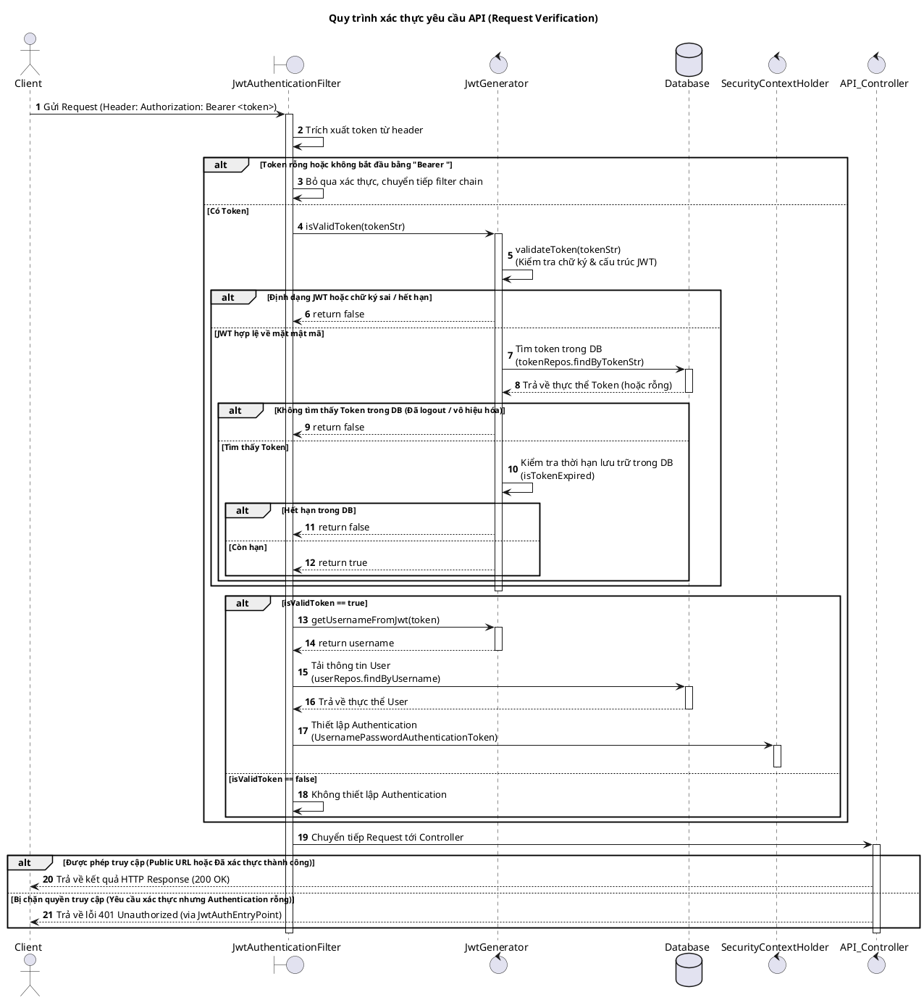

# Tài Liệu Xác Thực API (Authentication)

Tài liệu này mô tả chi tiết cơ chế xác thực đang được sử dụng trong hệ thống Easy English BE.

---

## 1. Kiến Trúc Xác Thực Tổng Quan

Hệ thống sử dụng **Spring Security** làm framework bảo mật cốt lõi, hoạt động ở chế độ phi trạng thái (**Stateless Session Management**) kết hợp với cơ chế whitelist Token trong cơ sở dữ liệu (**Database Whitelist**).

* **Mã hóa mật khẩu**: Sử dụng `BCryptPasswordEncoder` (độ dài mặc định 10 vòng) để băm mật khẩu người dùng.
* **CORS Configuration**: Cho phép các nguồn gốc (origins) từ danh sách được định nghĩa trong thuộc tính `frontend.urls`, hỗ trợ các phương thức: `GET`, `POST`, `PUT`, `DELETE`.
* **State Management**: Cấu hình `SessionCreationPolicy.STATELESS`, máy chủ không tạo `JSESSIONID` và không lưu trữ trạng thái người dùng trên Session của ứng dụng Web.

---

## 2. Cơ Chế Token JWT Kết Hợp Database Whitelist

Hệ thống sử dụng JSON Web Token (JWT) được ký bằng thuật toán **HMAC SHA-256 (`HS256`)** với khóa bí mật Base64 cấu hình tại `security.jwt.secret-key`.

### Luồng Hoạt Động Của Token:
1. **Một thiết bị/phiên hoạt động cho mỗi User**:
   * Khi người dùng đăng nhập thành công, một JWT mới được sinh ra chứa thông tin định danh (`subject` là `username`), thời điểm phát hành (`issuedAt`), và thời điểm hết hạn (`expiration`).
   * Hệ thống tìm kiếm bản ghi trong bảng `Token` dựa trên username. Nếu đã tồn tại token cũ, hệ thống sẽ **cập nhật đè** chuỗi JWT mới và thời hạn mới lên bản ghi cũ. Nếu chưa có, hệ thống sẽ tạo mới.
   * Điều này có nghĩa là **mỗi người dùng chỉ có tối đa một Token hợp lệ hoạt động tại một thời điểm**. Việc đăng nhập ở thiết bị mới sẽ gián tiếp làm mất hiệu lực token ở thiết bị cũ (chỉ có token mới nhất lưu trong DB được chấp nhận).
2. **Đăng xuất (Logout)**:
   * Khi người dùng thực hiện yêu cầu đăng xuất (`/api/v1/auth/logout`), hệ thống sẽ xóa bản ghi token của người dùng đó khỏi bảng `Token`. Token đó ngay lập tức bị đưa ra khỏi danh sách whitelist và không thể dùng để xác thực nữa.

---

## 3. Bộ Lọc Xác Thực Yêu Cầu (`JwtAuthenticationFilter`)

Đối với tất cả các API nằm ngoài danh sách công khai, hệ thống sẽ chặn yêu cầu thông qua `JwtAuthenticationFilter` (kế thừa `OncePerRequestFilter`) và thực hiện quy trình sau:

1. **Trích xuất**: Đọc tiêu đề `Authorization` từ HTTP Request. Nếu tiêu đề bắt đầu bằng chuỗi `Bearer ` (độ dài 7 kí tự), hệ thống lấy phần chuỗi Token phía sau.
2. **Kiểm tra tính hợp lệ của Token (`JwtGenerator.isValidToken`)**:
   * **Bước 2.1 (Validate JWT)**: Kiểm tra định dạng cấu trúc JWT, chữ ký signature hợp lệ và thời gian hết hạn của JWT từ payload.
   * **Bước 2.2 (Database Check)**: Truy vấn trong cơ sở dữ liệu bảng `Token` tìm kiếm chuỗi token tương ứng. Nếu không tìm thấy, token bị coi là không hợp lệ (ngay cả khi chữ ký JWT vẫn đúng).
   * **Bước 2.3 (Database Expiry Check)**: So sánh thời gian hết hạn được lưu trữ trong DB với thời gian hiện tại.
3. **Thiết lập quyền truy cập**:
   * Nếu token hoàn toàn hợp lệ, hệ thống lấy `username` từ JWT subject, tải thông tin thực thể `User` từ Database.
   * Tạo đối tượng `UsernamePasswordAuthenticationToken` chứa thông tin user và danh sách quyền (`user.getAuthorities()`), sau đó đặt vào `SecurityContextHolder`.
4. **Xử lý lỗi**:
   * Nếu token không hợp lệ hoặc thiếu, bộ lọc sẽ bỏ qua việc đặt Authentication.
   * Spring Security sẽ chặn yêu cầu tại các cấu hình URL bảo mật và trả về mã trạng thái `401 Unauthorized` thông qua điểm truy cập lỗi `JwtAuthEntryPoint`.

---

## 4. Các Endpoint Xác Thực Chính (`/api/v1/auth`)

Hệ thống cấu hình các URL sau được phép truy cập tự do (không cần token):
* `/api/v1/auth/login` và `/api/v1/auth/register/**`
* Các luồng OTP: kích hoạt tài khoản (`active-account/**`, `resend-otp-to-active-account/**`), quên mật khẩu (`generate-otp-to-reset-password/**`, `reset-password-with-otp/**`), đăng nhập bằng OTP (`generate-otp-to-login/**`, `login-with-otp/**`)
* Đăng nhập bên thứ ba: `/api/v1/auth/login-with-google`
* Các tài liệu API Swagger UI và WebSocket endpoint `/ws/**`

Các luồng xác thực nâng cao:
* **Google Login**: Sử dụng `GoogleAuthService` xác thực mã ID Token được cung cấp bởi phía Client. Nếu tài khoản Google chưa có trong hệ thống, hệ thống tự động đăng ký tài khoản mới ở trạng thái `INACTIVE` và yêu cầu kích hoạt qua OTP.
* **OTP Login**: Cho phép xác thực 2 bước. Sau khi kiểm tra thông tin đăng nhập đúng, hệ thống gửi mã OTP qua email, Client cần gửi lại OTP chính xác để nhận token JWT hoạt động.

---

## 5. Sequence Diagram: Quy Trình Xác Thực Yêu Cầu API (Request Verification)

Sơ đồ tuần tự dưới đây thể hiện cú pháp **PlantUML** mô tả cách mà `JwtAuthenticationFilter` chặn và xác thực một yêu cầu API từ Client:

